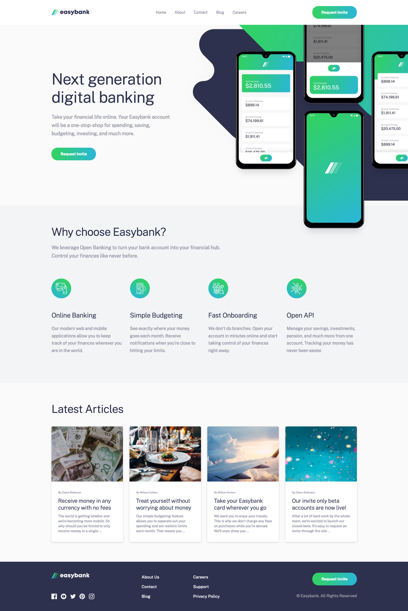

# Easybank landing page

Easybank is a digital banking application that gives users insight into their daily finances.

## Screenshot

This is a solution to the [Easybank landing page challenge on Frontend Mentor](https://www.frontendmentor.io/challenges/easybank-landing-page-WaUhkoDN).

## Overview

Building a fully responsive landing page using semantic HTML5, CSS3 and Vanilla JS.

### Links

- Live Site URL: [Link](https://nabzay.github.io/easybank-landing-page)

## Process

### Built with

- Semantic HTML5 markup
- CSS custom properties
- Flex
- CSS Grid
- Pseudo elements
- Mobile-first workflow
- Basic animations
- Vanilla JS

## Author

- Frontend Mentor - [@nabzay](https://www.frontendmentor.io/profile/nabzay)
- Portfolio - Under Construction
